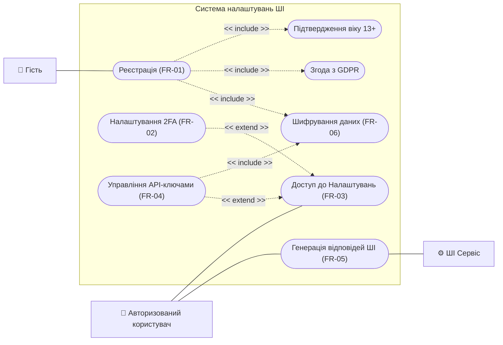
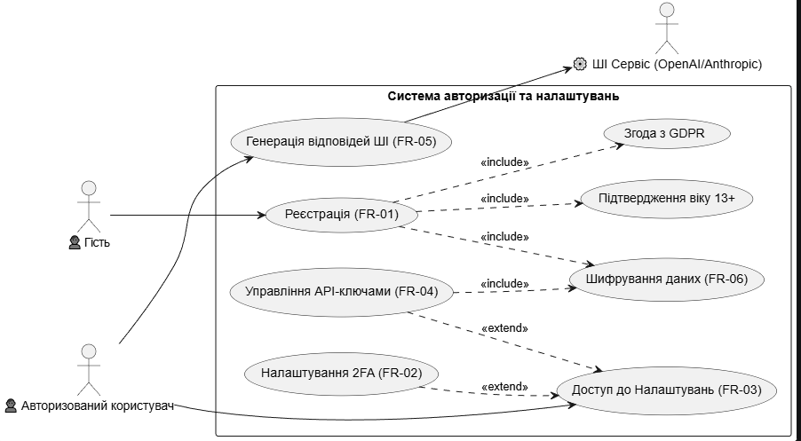
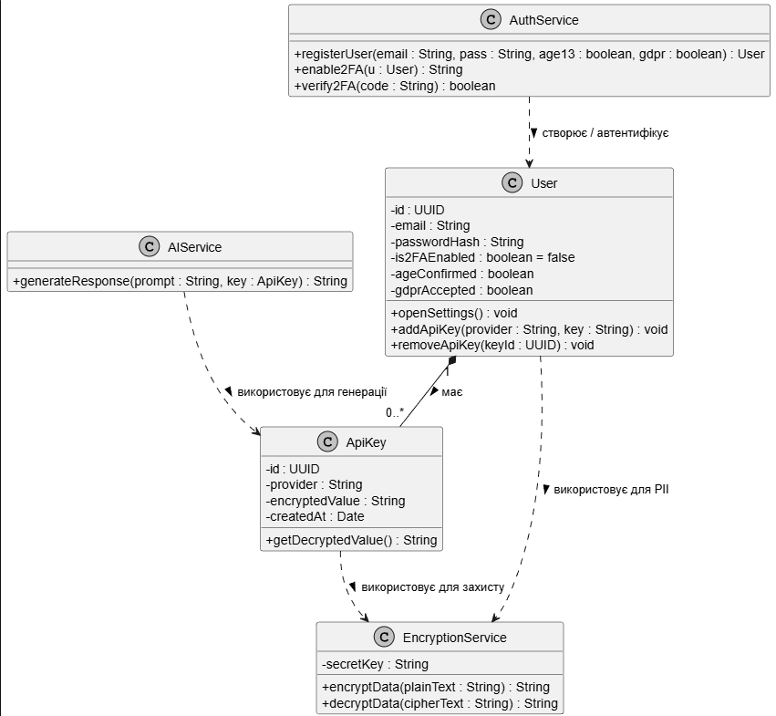
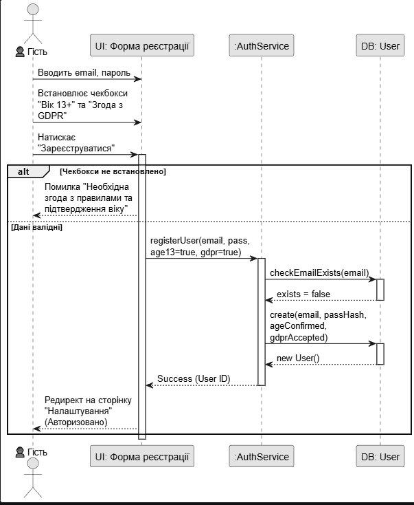

Лабораторна робота № 2: Моделювання програмної системи засобами UML

Виконав: Волошин Данило, ПЗПІ-25-6  
Предметна область: Система авторизації та управління налаштуваннями (API-ключами) для платформи з інтеграцією ШІ.

 Крок 2. Функціональні вимоги

У таблиці нижче наведено 6 ключових функціональних вимог (Functional Requirements), сформованих на основі бізнес-логіки системи та вимог безпеки (GDPR).

| ID        | Функціональна вимога                                                                                                       | Пріоритет |
| :-------- | :------------------------------------------------------------------------------------------------------------------------- | :-------- |
| **FR-01** | Система має забезпечувати реєстрацію нових користувачів із обов'язковим підтвердженням віку (13+) та згодою з GDPR.        | Високий   |
| **FR-02** | Система має дозволяти користувачу налаштовувати двофакторну автентифікацію (2FA) для свого облікового запису.              | Високий   |
| **FR-03** | Система має надавати авторизованому користувачу доступ до закритої сторінки "Налаштування" для керування профілем.         | Середній  |
| **FR-04** | Система має дозволяти користувачу додавати, зберігати, оновлювати та видаляти власні API-ключі (OpenAI, Anthropic).        | Високий   |
| **FR-05** | Система має забезпечувати генерацію відповідей ШІ, використовуючи збережений API-ключ конкретного користувача.             | Високий   |
| **FR-06** | Система має автоматично шифрувати збережені API-ключі та персональні дані користувачів у базі даних згідно з нормами GDPR. | Високий   |

Крок 3. Діаграма прецедентів (Use Case)

Діаграма відображає основні ролі (Гість, Авторизований користувач) та їхню взаємодію з функціоналом системи.

  Крок 4. Діаграма класів (Class Diagram)
Діаграма описує статичну структуру системи: класи, їхні атрибути, методи та взаємозв'язки.

Код PlantUML:

Фрагмент кода
@startuml
skinparam monochrome true
skinparam shadowing false

class User {
  - id : UUID
  - email : String
  - passwordHash : String
  - is2FAEnabled : boolean
  - ageConfirmed : boolean
  - gdprAccepted : boolean
  + openSettings() : void
  + addApiKey(provider, key) : void
}

class ApiKey {
  - id : UUID
  - provider : String
  - encryptedValue : String
  + getDecryptedValue() : String
}

class AuthService {
  + registerUser(email, pass, age13, gdpr) : User
  + enable2FA(u : User) : String
}

class EncryptionService {
  + encryptData(plainText) : String
  + decryptData(cipherText) : String
}

class AIService {
  + generateResponse(prompt, key) : String
}

User "1" *-- "0..*" ApiKey
AuthService ..> User
ApiKey ..> EncryptionService
AIService ..> ApiKey
@enduml
Діаграма:

Крок 5. Діаграма послідовності (Sequence Diagram)
Візуалізація сценарію FR-01: Реєстрація користувача з перевіркою валідації чекбоксів та збереженням у БД.

Код PlantUML:

Фрагмент кода
@startuml
skinparam monochrome true
actor "Гість" as G
participant "UI: Реєстрація" as UI
participant ":AuthService" as Auth
participant "DB: User" as DB

G -> UI : Вводить дані та чекбокси
activate UI
alt Чекбокси не встановлено
    UI --> G : Помилка валідації
else Дані валідні
    UI -> Auth : registerUser(...)
    activate Auth
    Auth -> DB : create(user)
    activate DB
    DB --> Auth : success
    deactivate DB
    Auth --> UI : success
    deactivate Auth
    UI --> G : Редирект в профіль
end
deactivate UI
@enduml
Діаграма:

 Крок 6. Матриця трасовності

Зведена таблиця, що підтверджує покриття кожної вимоги відповідними UML-артефактами. Для зручності читання тут продубльовано повний текст кожної функціональної вимоги.

| ID        | Функціональна вимога                                                                                                       | Use Case          | Задіяні класи                 | Sequence Diagram       |
| :-------- | :------------------------------------------------------------------------------------------------------------------------- | :---------------- | :---------------------------- | :--------------------- |
| **FR-01** | Система має забезпечувати реєстрацію нових користувачів із обов'язковим підтвердженням віку (13+) та згодою з GDPR.        | UC1, UC1_1, UC1_2 | `User`, `AuthService`         | **SD-01** (Реєстрація) |
| **FR-02** | Система має дозволяти користувачу налаштовувати двофакторну автентифікацію (2FA) для свого облікового запису.              | UC2               | `User`, `AuthService`         | —                      |
| **FR-03** | Система має надавати авторизованому користувачу доступ до закритої сторінки "Налаштування" для керування профілем.         | UC3               | `User`                        | —                      |
| **FR-04** | Система має дозволяти користувачу додавати, зберігати, оновлювати та видаляти власні API-ключі (OpenAI, Anthropic).        | UC4               | `User`, `ApiKey`              | —                      |
| **FR-05** | Система має забезпечувати генерацію відповідей ШІ, використовуючи збережений API-ключ конкретного користувача.             | UC5               | `AIService`, `ApiKey`         | —                      |
| **FR-06** | Система має автоматично шифрувати збережені API-ключі та персональні дані користувачів у базі даних згідно з нормами GDPR. | UC6               | `EncryptionService`, `ApiKey` | —                      |
